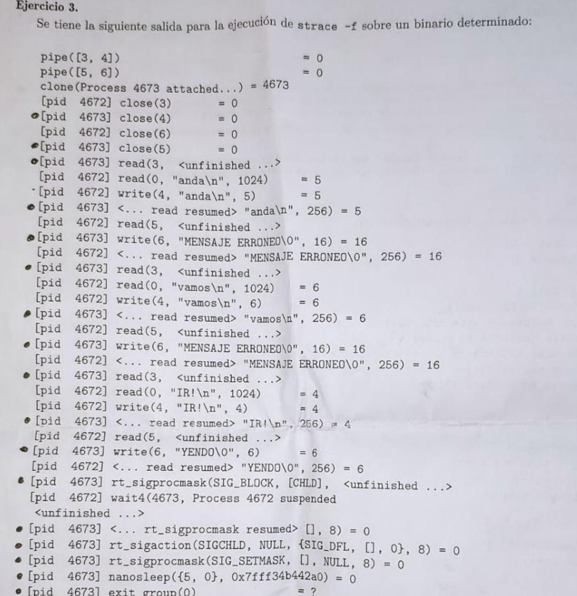
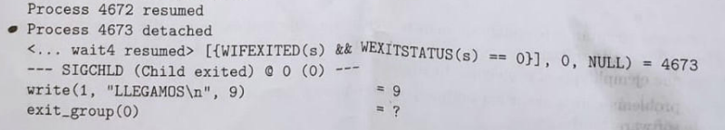
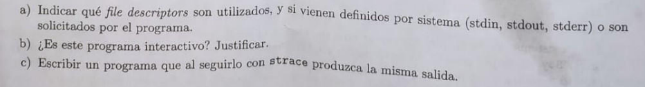

***Parcialito***
---
Considerar el codigo:

    int ticket = 0;
    int turno = 0;

    void proc()
    {
        cosas_no_criticas();
        int miTurno = obtenerTurno();
        while(miTurno != turno) {}

        funcion_critica();
        terminarTurno();
        cosas_no_criticas();
    }

    obtenerTurno()
    {
        int temp = ticket;
        ticket++;
        return temp;
    } 

    terminarTurno()
    {
        turno++;
    }

(a) Si dos procesos ejecutan este codigo de manera concurrente, determinar si al utilizar las funciones obtenerTurno y terminarTurno se delimita correctamente una seccion critica. En caso contrario, mostrar una traza que explique el problema. Justificar

    Las funciones obtenerTurno y terminarTurno delimitan espantosamente una seccion critica ya que no asegura que solo un proceso acceda a los varibles globales de manera exlusiva. 
    
    Propongo una posible traza:
    
    P1                     P2                     ticket      miTurno1  miTurno2   tempP1  tempP2
    cosas_no_criticas()                             0           -       -           -       -
    scheduler              cosas_no_criticas()      0           -       -           -       -
    int temp = ticket      scheduler                0           -       -           0       -
    scheduler              int temp = ticket        0           -       -           0       0
    ticket++               scheduler                1           -       -           0       0    
    scheduler              ticket++                 2           -       -           0       0    
    int miTurno = temp1    scheduler                2           0       -           0       0      
    scheduler              int miTurno = temp2      2           0       0           -       -

    Aca se ve claramente el problema, se asigno el mismo numero de turno a ambos procesos que ejecutaron de manera concurrente un mismo programa, sin cuidar la exclusion mutua que es la que garantiza correctitud a la hora de usar variables globales.

(b) Si hay un problema con la exclusion mutua, ¿como se podria arreglar? Justificar como y con que mecanismos de software/hardware.

    Se soluciona con la ayuda de Semaforos (tipo de dato abstracto) que es un modulo de software que proveen los SO para garantizar sincronizacion y correctitud.

    semaforo mutex = init_sem(1);

    int ticket = 0;
    int turno = 0;

    void proc()
    {
        cosas_no_criticas();
        
        mutex.wait();
        int miTurno = obtenerTurno();
        mutex.signal();
        
        while(miTurno != turno) {} // wait busy pero no es mi codigo

        mutex.wait();
        funcion_critica();
        terminarTurno();
        mutex.signal();
        

        cosas_no_criticas();
    }

    obtenerTurno()
    {
        int temp = ticket;
        ticket++;
        return temp;
    } 

    terminarTurno()
    {
        turno++;
    }

**Ejericicio 2**
---
Sea un sistema donde un proceso parent crea un child y el child crea un grandchild. El grandchild debe imprimir "Soy el mejor nieto", luego dormir por 60 segundos, una vez pasado el minuto avisar al child que se deperto usando pipes y por ultimo colgarse con un while(TRUE);. Al llegar al punto de cuelgue y recibir el mensaje por parte del grandchild, el child debe matarlo y hacer un exit. Por ultimo el parent espera a que el child termine e imprime "Mi hijo querido se ha ido" y termina.

(a) Escribir un programa (en pseudocodigo) que se comporte como el sistema descrito, utilizando las syscalls necesarias. Dado que se trata de pseudocodigo, no es necesario ser estricto con los parametros y valores de los syscalls, aunque si respetar su espiritu.

    void hijoTrabajo()
    {
        int pipeConNieto[2];
        pipe(pipeConNieto);

        pid_t nieto = fork();
        
        if (hijo == 0)
        {
            nietoTrabajo(pipeConNieto[]);
        }
        close(pipeConNieto[WRITE]);

        int b;
        read(pipeConNieto[READ], &b, sizeof(int));
        
        close(pipeConNieto[READ]);

        kill(nieto, sigkill);
        exit(EXIT_SUCCESS);

    }

    void nietoTrabajo(int pipeConmigo[])
    {
        close(pipeConmigo[READ]);
        
        printf("Soy el mejor nieto");
        sleep(60);

        int b = 1;
        write(pipeConmigo[WRITE], &b, sizeof(int));
        
        close(pipeConmigo[WRITE]);

        while(1){};
    }

    int main()
    {
        pid_t hijo = fork();
        if (hijo == 0)
        {
            hijo_trabajo();   
        }

        waitpid(hijo, WNOHANG, 0);

        printf("Mi hijo querido se ha ido...");

        return EXIT_SUCCESS;
    }

(b) Describir en que estado queda cada uno de los procesos involucrados luego de la ejecucion de cada syscall.

    Proceso Padre
    Ejecuta fork y luego se pone a esperar la terminacion de su hijo con waitpid, despues cuando le llegue sigchild (hijo se automato) entonces imprime el mensaje pedido y hace exit.

    Proceso Hijo
    Crea los pipes de comunicacion con su propio hijo (nieto), hace el fork, cierra el extremo de escritura ya leera lo que le escriba el nieto, y hace read al pipe del nieto tq se bloquea (read es bloqueante). Cuando se desbloquea (el nieto le escribio), entonces mata al hijo y se suicida :/.

    Proceso Nieto
    El nieto cierra el fd correspondiente, imprime que es el mejor, se pone a dormir un minuto, manda mensaje a su propio padre, cierra su fd y loopea por la eternidad (hasta que su padre decide lo contrario).

**Ejercicio 3**
---

(a) FD: 3, 4, 5, 6 de los pipes y 0 que es de stdin.

(b) Si, ya que el proceso con PID 4672 lee de stdin 3 veces, el cual por convencion es el fd que se utiliza para leer entrada del user. 

(c) 

    #define forn(i,n) for(int i = 0; i < n; i++)
    void main()
    {
        // 4672
        int pipeA[2];
        int pipeB[2];
        pipe(pipeA); // [3,4]
        pipe(pipeB); // [5,6]   

        pid_t hijo = fork(); // 4673
        if (hijo == 0)
        {
            // 4673
            close(pipeA[WRITE]);
            close(pipeB[READ]);
            
            char msg[256] = {0};

            char msgFinal[4] = "IR!\0"
            while(strcmp(msg, msgFinal) != 0)
            {
                read(stdin, &msg, 256);
                if (strcmp(msg, msgFinal) != 0){
                    write(pipeA[WRITE], "MENSAJE ERRONEO\0", 16);
                }
                read(pipeB[READ], &msg, 256);
            }

            write(pipeB[WRITE], "YENDO\O", 16);

            sigprocaction(SIG_BLOCK, [CHLD], 8);
            sigaction(SIGCHILD, NULL, {SIG_DFL, [], 0});
            nanosleep({5,0}, 0x7fff34b442a0);
            exit(EXIT_SUCCESS);
        }
        else
        {
            // 4672
            int len;

            close(pipeA[WRITE]);
            close(pipeB[READ]);

            char msg[1024]; 

            char msgFinal[6] = "Yendo!\0"
            while(strcmp(msg, msgFinal) != 0)
            {
                read(stdin, &msg, 1024);
                write(pipeA[WRITE], &msg, len);
                read(pipeB[READ], &msg, 256);
            }
            wait4(hijo, ...);
            printf("Llegamos!");
        }
    
        return;
    }