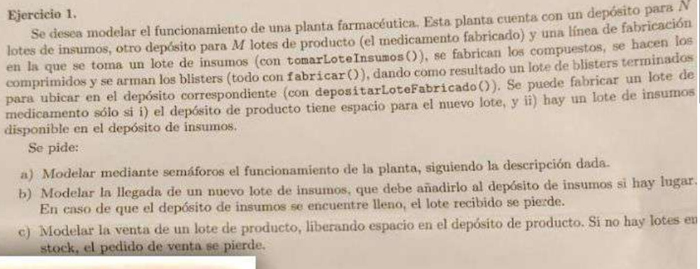
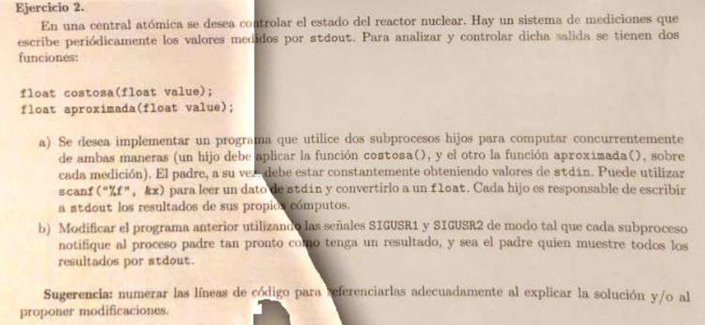
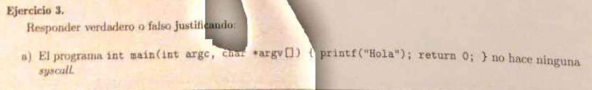
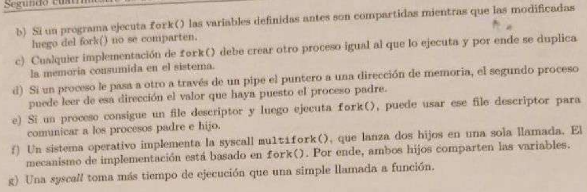

***Ejercicio 1***
---

    int N, M;

    int lotesOcupadosInsumos = 0;
    int lotesOcupadosProductos = 0;

    // La fabrica esta vacia de insumos al inicio...
    semaforo loteDeInsumosDisponible = sem_init(0); // Tenes 0

    // y particularmente tenes espacio para almacenar
    semaforo espacioParaProductos = sem_init(M);   // tenes M espacios

    semaforo mutex = sem_init(1);

    void planta()
    {
        // Linea de Fabricacion
        while(1)
        {
            espacioParaProductos.wait(); // reservamos Lote
            loteDeInsumosDisponible.wait();  // agarramos lote de insumos

            tomarLoteInsumos();
            fabricar();
            depositarLoteFabricado();
            
            mutex.wait();
            lotesOcupadosInsumos--;
            lotesOcupadosProductos++;
            mutex.signal();
        }

    }

    (b)
    void lleganInsumos()
    {
        mutex.wait();
        if (lotesOcupadosInsumos < N)
        {
            loteDeInsumosDisponible.signal();
            lotesOcupadosInsumos++;
        }
        mutex.signal();
    }

    (c)
    void venderProducto()
    {
        mutex.wait();
        if (lotesOcupadosProductos > 0)
        {
            espacioParaProductos.signal();
            lotesOcupadosProductos--;
        }
        mutex.signal();
    }

***Ejercicio 2***
---

(a)

    void hijoCostosaFuncion(int pipeCostosa[], int pipeAproximada[])
    {
        close(pipeCostosa[WRITE]);
        
        close(pipeAproximada[WRITE]);
        close(pipeAproximada[READ]);

        float x;
        while(read(pipeCostosa[READ], &x, sizeof(float))>0)
        {
            float computo = costosa(x);
            write(stdout, &computo, sizeof(float));
        }

        close(pipeCostosa[READ]);
        exit(EXIT_SUCCESS);
    }

    void hijoAproximadaFuncion(int pipeCostosa[], int pipeAproximada[])
    {
        close(pipeAproximada[WRITE]);
        
        close(pipeCostosa[WRITE]);
        close(pipeCostosa[READ]);

        float x;
        while(read(pipeAproximada[READ], &x, sizeof(float))>0)
        {
            float computo = aproximada(x);
            write(stdout, &computo, sizeof(float));
        }

        close(pipeAproximada[READ]);
        exit(EXIT_SUCCESS);
    }

    int main()
    {
        int pipeCostosa[2];
        int pipeAproximada[2];
        pipe(pipeCostosa);
        pipe(pipeAproximada);

        pid_t hijoCostosa = fork();
        if (hijoCostosa == 0)
        {
            hijoCostosaFuncion(pipeCostosa[], pipeAproximada[]);
        }
        
        pid_t hijoAproximada = fork();
        if (hijoAproximada == 0)
        {
            hijoAproximadaFuncion(pipeCostosa[], pipeAproximada[]);
        }

        // recableado, yo no leo, yo escribo
        close(pipeCostosa[READ]);
        close(pipeAproximada[READ]);

        float x;
        while(scanf("%f", &x) == 1)
        {
            write(pipeCostosa[WRITE], &x, sizeof(float));
            write(pipeAproximada[WRITE], &x, sizeof(float));
        }
        
        close(pipeCostosa[WRITE]);
        close(pipeAproximada[WRITE]);

        wait(NULL);wait(NULL);

        return EXIT_SUCCESS;
    }

(b) Usando señales para que el padre imprima por stdout

    int pipePadreToCostosa[2];
    int pipeCostosaToPadre[2];

    int pipePadreToAproximada[2];
    int pipeAproximadaToPadre[2];

    void hijoCostosaFuncion(int pipeCostosa[], int pipeAproximada[])
    {
        close(pipePadreToCostosa[WRITE]);
        close(pipeCostosaToPadre[READ]);

        close(pipeAproximadaToPadre[WRITE]);
        close(pipeAproximadaToPadre[READ]);
        
        close(pipePadreToAproximada[READ]);
        close(pipePadreToAproximada[WRITE]);

        float x;
        while(read(pipePadreToCostosa[READ], &x, sizeof(float))>0)
        {
            float computo = costosa(x);
            
            kill(getppid(), SIGUSR1);
            
            write(pipeCostosaToPadre[WRITE], &computo, sizeof(float));
        }

        close(pipeCostosa[READ]);
        exit(EXIT_SUCCESS);
    }

    void hijoAproximadaFuncion(int pipeCostosa[], int pipeAproximada[])
    {
        close(pipePadreToCostosa[WRITE]);
        close(pipePadreToCostosa[READ]);

        close(pipeCostosaToPadre[READ]);
        close(pipeCostosaToPadre[WRITE]);

        close(pipeAproximadaToPadre[READ]);
        close(pipePadreToAproximada[WRITE]);

        float x;
        while(read(pipePadreToAproximada[READ], &x, sizeof(float))>0)
        {
            float computo = aproximada(x);

            kill(getppid(), SIGUSR2);

            write(pipeAproximadaToPadre[WRITE], &computo, sizeof(float));
        }

        close(pipeAproximada[READ]);
        exit(EXIT_SUCCESS);
    }

    void handl1()
    {
        
    }

    void handl2()
    {
        
    }

    int main()
    {
        pipe(pipePadreToCostosa);
        pipe(pipeCostosaToPadre);

        pipe(pipePadreToAproximada);
        pipe(pipeAproximadaToPadre);

        pid_t hijoCostosa = fork();
        if (hijoCostosa == 0)
        {
            hijoCostosaFuncion();
        }
        
        pid_t hijoAproximada = fork();
        if (hijoAproximada == 0)
        {
            hijoAproximadaFuncion();
        }

        //int sigsuspend(const sigset_t *mask); Construyo la mascara
        sigset_t mask, oldSet;
        sigaddset(&mask, SIGUSR1);
        sigaddset(&mask, SIGUSR2);

        sigprocmask(SIG_BLOCK, &mask, &oldSet); // bloqueo las señales que voy a rehandlear para generar una cola

        signal(SIGUSR1, handl1); // rehandleo medio inutil, solo quiero despertar verdad????
        signal(SIGUSR2, handl2);

        // cerrar fds innecesarios
        close(pipePadreToCostosa[READ]);
        close(pipePadreToAproximada[READ]);
        close(pipeCostosaToPadre[WRITE]);
        close(pipeAproximadaToPadre[WRITE]);

        float x;
        float computo;
        while(scanf("%f", &x) == 1)
        {
            write(pipePadreToCostosa[WRITE], &x, sizeof(float));
            write(pipePadreToAproximada[WRITE], &x, sizeof(float));

            sigsuspend(&oldSet);
            sigsuspend(&oldSet);
            
            read(pipeCostosaToPadre[READ], &computo, sizeof(float));
            write(stdout, &computo, sizeof(float));
            
            read(pipeAproximadaToPadre[READ], &computo, sizeof(float));
            write(stdout, &computo, sizeof(float));
            
        }
        
        close(pipePadreToCostosa[WRITE]);
        close(pipePadreToAproximada[WRITE]);
        close(pipeCostosaToPadre[READ]);
        close(pipeAproximadaToPadre[READ]);

        wait(NULL);wait(NULL);

        return EXIT_SUCCESS;
    }

***Ejercicio 3***
---

