**Parte 1 – Estado y operaciones sobre procesos**
---

Ejercicio 1: ¿Cuáles son los pasos que deben llevarse a cabo para realizar un cambio de contexto?
---

El SO se encarga a traves del modulo de software llamado scheduler,
que a cada ciclo de clock cambia de proceso siguiendo estos pasos:
    1. Se busca el descriptor de TSS del proceso actual en la gdt.
    2. Se Almacena el estado de la tarea en ejecucion en el TSS 
    (TASK STATE SEGMENT) correspondiente.  
    3. Se carga la TSS de la siguiente tarea a ser ejecutada 
    (decide el scheduler) en todos los registros correspondientes.
    4. La siguiente tarea continua su ejecucion.


Ejercicio 2: El PCB (Process Control Block) de un sistema operativo para una arquitectura de 16 bits es
---
```
struct PCB 
{
    int STAT;       // valores posibles KE_RUNNING, KE_READY, KE_BLOCKED, KE_NEW
    int P_ID;       // process ID
    int PC;         // valor del PC del proceso al ser desalojado
    int RO;         // valor del registro R0 al ser desalojado
    ...
    int R15;        // valor del registro R15 al ser desalojado
    int CPU_TIME    // tiempo de ejecución del proceso
}
```

(a) Implementar la rutina Ke_context_switch(PCB* pcb_0, PCB* pcb_1), encargada de realizar el
cambio de contexto entre dos procesos (cuyos programas ya han sido cargados en memoria) debido
a que el primero ha consumido su quantum. pcb_0 es el puntero al PCB del proceso a ser desalojado
y pcb_1 al PCB del proceso a ser ejecutado a continuación. Para implementarla se cuenta con un
lenguaje que posee acceso a los registros del procesador R0, R1, ..., R15, y las siguientes operaciones:
```
·=·; // asignación entre registros y memoria
int ke_current_user_time(); // devuelve el valor del cronómetro
void ke_reset_current_user_time(); // resetea el cronómetro
void ret(); // desapila el tope de la pila y reemplaza el PC
void set_current_process(int pid); // asigna al proceso con el pid como el siguiente a ejecutarse
```

```
void Ke_context_switch(PCB* pcb_0, PCB* pcb_1)
{
    // Guardo el estado de la tarea a ser desalojada
    pcb_0.STAT ·=· 1;

    pcb_0.R0 ·=· R0;
    pcb_0.R1 ·=· R1;
    pcb_0.R2 ·=· R2;
    pcb_0.R3 ·=· R3;
    pcb_0.R4 ·=· R4;
    pcb_0.R5 ·=· R5;
    pcb_0.R6 ·=· R6;
    pcb_0.R7 ·=· R7;
    pcb_0.R8 ·=· R8;
    pcb_0.R9 ·=· R9;
    pcb_0.R10 ·=· R10;
    pcb_0.R11 ·=· R11;
    pcb_0.R12 ·=· R12;
    pcb_0.R13 ·=· R13;
    pcb_0.R14 ·=· R14;
    pcb_0.R15 ·=· R15;
    pcb_0.CPU_TIME ·=· pcb_0.CPU_TIME + ke_current_user_time();

    pcb_1.STAT ·=· 0;

    R0 ·=· pcb_1.R0;
    R1 ·=· pcb_1.R1;
    R2 ·=· pcb_1.R2;
    R3 ·=· pcb_1.R3;
    R4 ·=· pcb_1.R4;
    R5 ·=· pcb_1.R5;
    R6 ·=· pcb_1.R6;
    R7 ·=· pcb_1.R7;
    R8 ·=· pcb_1.R8;
    R9 ·=· pcb_1.R9;
    R10 ·=· pcb_1.R10;
    R11 ·=· pcb_1.R11;
    R12 ·=· pcb_1.R12;
    R13 ·=· pcb_1.R13;
    R14 ·=· pcb_1.R14;
    R15 ·=· pcb_1.R15;
    
    ke_reset_current_user_time();
    set_current_process(pcb_1.P_ID);
    ret();
}
```

(b) Identificar en el programa escrito en el punto anterior cuáles son los pasos del ejercicio 1.

Esta es la parte de almacenar el estado de la tarea en memoria y cargar el estado de la siguiente tarea en los recursos de la arquitectura.

Ejercicio 3: Describir la diferencia entre un system call y una llamada a función de biblioteca.
---

Una system call es una API para que el usuario se pueda comunicar con el SO, es decir pueda hacer uso de los servicios que la SO le puede ofrecer. 

Mientras que una llamada a funcion de biblioteca es algo que facilita el uso de las system calls ya que estan escritos en lenguajes mas portables (ajenos a la arquitectura) que abstraen al usuario de la implementacion en bajo nivel.

Ejercicio 4
--- 
En el esquema de transición de estados que se incluye a continuación:
```
new---
     |   running --------------------
     |   |         |                |
     --ready -- blocked           terminated
```

(a) Dibujar las puntas de flechas que correspondan. También puede agregar las transiciones que
crea necesarias entre los estados disconexos y el resto.

(b) Explicar qué causa cada transición y qué componentes (scheduler, proceso, etc.) estarían in-
volucrados.

- Transicion new-ready: Cuando se inicia un proceso se le asignan su espacio en memoria, su PCB, 
    se le asigna un PID, etc; y se pone READY en su estado indicando al scheduler que
    puede ser ejecutada.

- Transicion ready-runnig: Cuando un proceso esta listo para ser ejecutado y el scheduler decide
    que es el siguiente proceso a ser ejecutado, primero guarda el estado del proceso actual en su
    PCB, actualiza/carga el estado del PCB del proceso ready y finalmente la pone en running.

- Transicion runnig-blocked: Cuando un proceso que esta siendo ejecutado y necesita algun recurso (memoria, dispositivo I/O, unidad funcional, etc) que no se puede acceder en el momento requerido entonces el scheduler se encarga de poner el estado del proceso en BLOCKED, que sera el estado del proceso hasta que el recurso requerido este disponible. 
     
- Transicion blocked-ready: Cuando un proceso esta en BLOCKED es porque esta esperando algun recurso que
requiere para poder seguirse ejecutando, cuando la unidad productora tiene el recurso listo se encarga
(por convencion) de avisar a traves de señales/interrupciones al SO para que finalmente el scheduler
ponga el proceso en READY.  

- Transicion running-terminated: Cuando un proceso termina su ejecucion , envia un exit() al scheduler que lo marca como TERMINATED.

Ejercicio 5 ⋆
---
Un sistema operativo ofrece las siguientes llamadas al sistema:

pid fork()                          Crea un proceso exactamente igual al actual y devuelve
                                    el nuevo process ID en el proceso padre y 0 en el proceso
                                    hijo.

void wait_for_child(pid child)      Espera hasta que el child indicado finalice su ejecución.

void exit(int exit_code)            Indica al sistema operativo que el proceso actual ha
                                    finalizado su ejecución.

void printf(const char *str)        Escribe un string en pantalla.

(a) Utilizando únicamente la llamada al sistema fork(), escribir un programa tal que construya un
árbol de procesos que represente la siguiente genealogía: Abraham es padre de Homero, Homero es
padre de Bart, Homero es padre de Lisa, Homero es padre de Maggie. Cada proceso debe imprimir
por pantalla el nombre de la persona que representa.

```
void main()
{
    pid_t homero = fork();

    if (homero == 0)
    {   
        pid_t bart = fork();

        if (bart == 0)
        {
            char* name = "Hola soy Bart";
            printf(name);
        }
        else
        {
            pid_t lisa = fork();

            if (lisa == 0)
            {
                char* name = "Hola soy Lisa";
                printf(name);
            }
            else
            {
                pid_t maggie = fork();

                if (maggie == 0)
                {
                    char* name = "Hola soy Maggie";
                    printf(name);
                    
                }
                else
                {
                    char* name = "Hola soy homero";
                    printf(name);
                }
            }
        }

    }
    else
    {
        char* name = "Hola soy Abraham";
        printf(name);    
    }
}
```

(b) Modificar el programa anterior para que cumpla con las siguientes condiciones: 1) Homero termine
sólo después que terminen Bart, Lisa y Maggie, y 2) Abraham termine sólo después que termine
Homero.

```
int main()
{
    printf("Hola soy Abraham!");

    pid_t homero = fork();
    if (homero == 0)
    {
        printf("Hola soy homero");

        pid_t lisa = fork();
        if (lisa == 0)
        {
            printf("Hola soy Lisa");
            exit(EXIT_SUCCESS);
        }
        else if(lisa > 0) {wait_for_child(lisa);}

        pid_t bart = fork();
        if (bart == 0)
        {
            printf("Hola soy el Barto");
            exit(EXIT_SUCCESS);
        }
        else if(bart > 0){wait_for_child(bart);}

        pid_t maggie = fork();
        if (maggie == 0)
        {
            printf("... agu ... el universo es muy confuso realmente");
            exit(EXIT_SUCCESS);
        }
        else if(maggie > 0){ wait_for_child(maggie);}

        exit(EXIT_SUCCESS);
    }
    wait_for_child(homero);
    exit(EXIT_SUCCESS);
}
```

Ejercicio 6
---
El sistema operativo del punto anterior es extendido con la llamada al sistema void exec(const char *arg). Esta llamada al sistema reemplaza el programa actual por el código localizado en el string (char *arg). Implementar una llamada al sistema que tenga el mismo comportamiento que la llamada void system(const char *arg), usando las llamadas al sistema ofrecidas
por el sistema operativo. Nota: Revisar man system, como ayuda.

```
void system(const char *arg)
{
    pid_t shellProgram = fork();

    if (shellProgram == 0)
    {
        exec(arg);
        exit(EXIT_SUCCESS);
    }
    else if (shellProgram > 0)
    {
        wait_for_child(shellProgram);
    }
    
    return;
}
```

Ejercicio 7: OK!.

Ejercicio 8: Simplemente cada proceso tiene su propia memoria asignada, aun si son el mismo programa.

Ejercicio 9 (Interfaz del SO POSIX - Señales) ⋆
Ping Pong: OK!

***Parte 2: PIC***
---

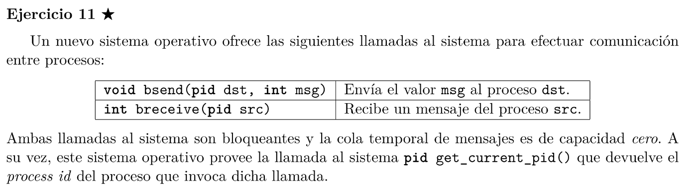
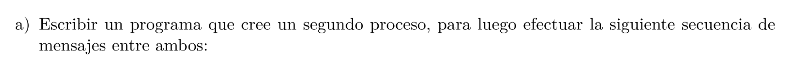
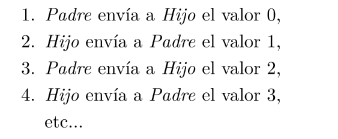


```
pid_t hijo;
pid_t dad;
int cur;

void padre_soy_yo()
{
    while (1)
    {
        bsend(hijo, cur);
        cur = breceive(hijo) + 1;
    }
}

void hijo()
{
    while(1)
    {
        bsend(dad,breceive(dad)+1);
    }
}

int main()
{
    cur = 0;
    dad = get_current_pid();
    hijo = fork();

    if (hijo==0)
    {
        hijo();
    }
    else if (hijo > 0)
    {
        padre_soy_yo();
    }
    return;
}
```

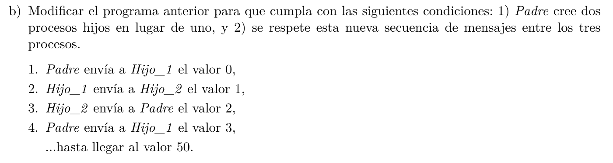
---

```
pid_t dad;
pid_t hijo;
pid_t hije2;
int cur;

void padre_soy_yo()
{
    bsend(hijo, hijo2);
    bsend(hijo2, hijo);

    while (cur<50)
    {
        bsend(hijo, cur);
        cur = breceive(hije2) + 1;
    }
    kill(hijo, SIGKILL);
    kill(hijo2, SIGKILL);
    exit(EXIT_SUCCESS);
}

void hijo()
{
    hermano2 = breceive(dad);
    while(1)
    {
        bsend(hermano2,breceive(dad)+1);
    }
}

void hije2()
{
    hermano1 = breceive(dad);
    while(1)
    {
        bsend(dad,breceive(hermano1)+1);
    }
}

int main()
{
    cur = 0;
    dad = get_current_pid();

    hijo = fork();
    if (hijo==0)
    {
        hijo();
    }
    else if (hijo > 0)
    {
        hijo2 = fork();

        if(hijo2 == 0)
        {
            hijo2();
        }
        else if (hijo2 > 0)
        {
            padre_soy_yo();
        }
        
    }
    return;
}
```

---
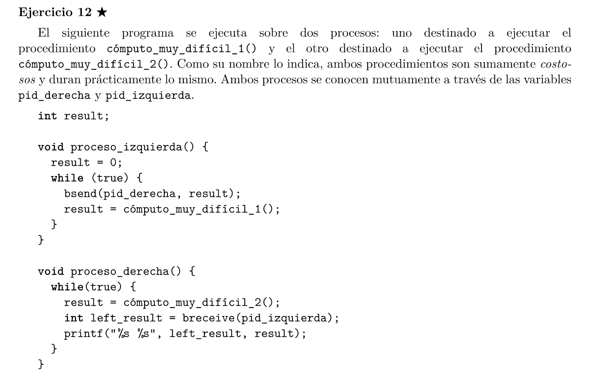
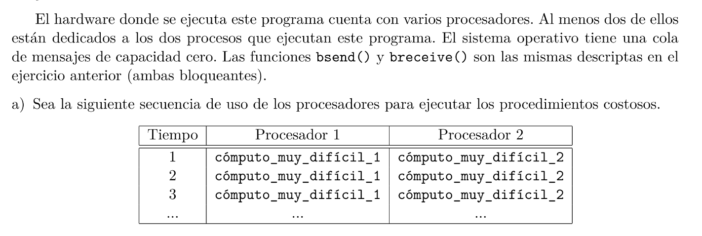
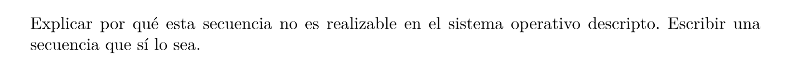
No es posible porque el proceso_izquierda queda bloqueado debido al bsend(pid_derecha, result) que espera que el mensaje sea recibido con breceive(pid_t p).

En cambio, si cambias el orden de las lineas en proceso_derecha() talque 
```
...
int left_result = breceive(pid_izquierda);
result = computo_muy_dificil_2();  
...
```
Entonces esta secuencia se cumplira.

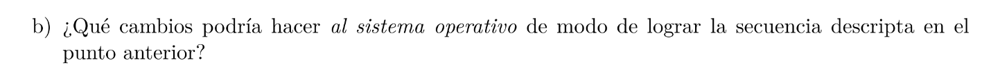
Que exista una cola/Buffer de mensajes.

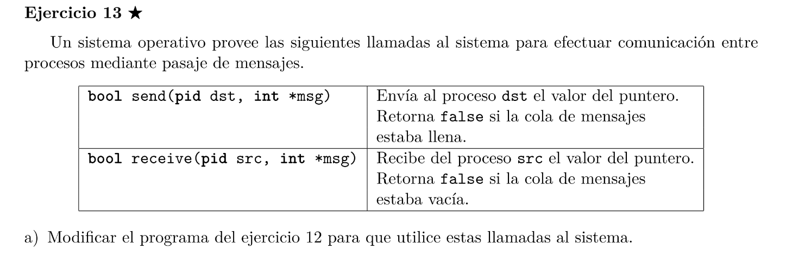
```
// Supongo que ya no son bloqueantes...

pid_t pid_derecha;
pid_t pid_izquierda;
int result;

void proceso_izquierda() 
{
    result = 0;
    while (true) {
        while (!bsend(pid_derecha, &result)) {}
        
        result = cómputo_muy_difícil_1();
    }
}
void proceso_derecha() {
    while(true) {
        result = cómputo_muy_difícil_2();
        int left_result;
        while(!breceive(pid_izquierda, &left_result);)
        
        printf("%s %s", left_result, result);
    }
}
```
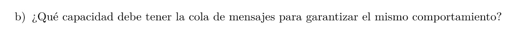
Minimo 32 bits, ya que ambos procesos tardan masomenos lo mismo, el problema era el bloqueo debido a la falta de un buffer intermedio.

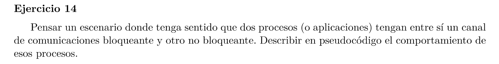
Basicamente cuando un proceso p1 necesita un valor de p2 (o viceversa) para poder seguir ejecutando, convendria entonces utilizar el canal bloqueante. Mientras que si ambos procesos ejecutan cosas que no dependen de parametros del otro proceso entonces no hay necesidad de espera y simplemente se usa el canal no bloqueante sise desea comunicar el valor.

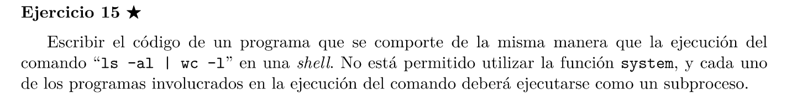
OK! Me salio muy bien

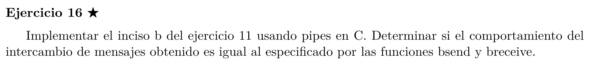
OK! Me salio muy bien y ademas si es parecido...

